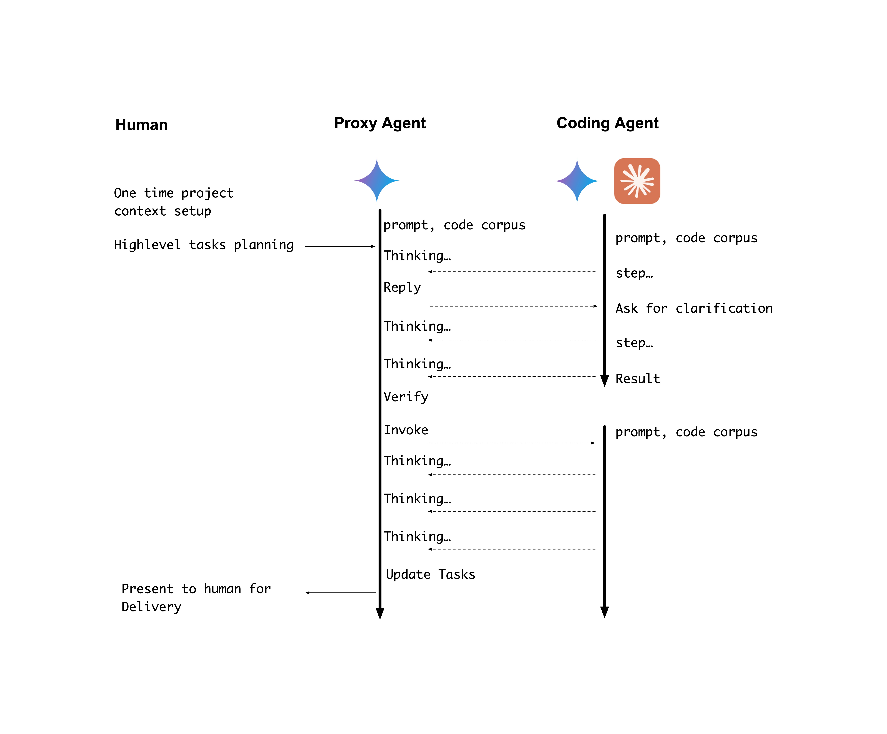

# Agent Proxy

An AI supervisor layer that orchestrates coding agents (Claude Code, Cursor, etc.) to complete complex development tasks autonomously.

## How It Works

Agent Proxy sits between human developers and AI coding agents, acting as an intelligent supervisor that:

1. **Maintains Context** - Stores project context, coding standards, and session history
2. **Supervises & Assigns** - Breaks down tasks and delegates to coding agents
3. **Unblocks** - Auto-responds to agent clarification requests
4. **Verifies** - Reviews agent output for correctness and quality
5. **Aligns & Refocuses** - Keeps agents on track toward the goal

### Architecture


The proxy maintains three types of context:
- **Project Context**: Company mission, OKRs, competitive analysis, mockups
- **Guidance & Practice**: Coding standards, QA checklists, team preferences
- **Sprint Session Context**: Current tasks and their status

### Execution Flow



1. Human provides one-time project context setup
2. Human assigns high-level tasks
3. Proxy Agent thinks, plans, and invokes the Coding Agent
4. Coding Agent executes steps, may ask for clarification
5. Proxy Agent auto-replies or redirects as needed
6. Proxy verifies results and updates task status
7. Final delivery presented to human

## Installation

### Basic Installation
```bash
pip install agentproxy
```

### With Server API Support
```bash
pip install agentproxy[server]
```

### With OpenTelemetry Support
```bash
pip install agentproxy[telemetry]
```

### Development Install
```bash
git clone https://github.com/allenday/agentproxy
cd agentproxy
pip install -e '.[all]'
```

## Setup

Create a `.env` file with your API key:
```bash
echo "GEMINI_API_KEY=your_key" > .env
```

## Usage

### Mode 1: CLI

After installation, use the `pa` command:

```bash
# Run a task
pa "Create hello.py"

# With working directory
pa -d ./myproject "Fix bug"

# With screenshot
pa --add-screenshot design.png "Match this UI"

# View sessions
pa --list-sessions

# Set default working directory
pa --set-workdir ./myproject "Fix bug"
pa --show-workdir

# Or use python -m
python -m agentproxy "Create a REST API"
```

### Mode 2: Server

Start the API server:

```bash
# Using pa-server command
pa-server

# Or with custom port
pa-server --port 8080

# Or with python -m
python -m agentproxy.server
```

API Examples:

```bash
# Start task
curl -N -X POST http://localhost:8000/task \
  -H "Content-Type: application/json" \
  -d '{"task": "Create hello.py", "working_dir": "./sandbox"}'

# With screenshot
curl -N -X POST http://localhost:8000/task \
  -H "Content-Type: application/json" \
  -d '{"task": "Match this UI", "screenshots": [{"path": "/path/to/design.png"}]}'

# Other endpoints
curl http://localhost:8000/health
curl http://localhost:8000/sessions
```

## Observability with OpenTelemetry

agentproxy supports OpenTelemetry for traces, metrics, and logs. This is **opt-in** and disabled by default.

### Quick Start

1. **Install with telemetry support**:
   ```bash
   pip install agentproxy[telemetry]
   ```

2. **Run an OTEL collector** (or use existing one):
   ```bash
   docker run -d -p 4317:4317 otel/opentelemetry-collector:latest
   ```

3. **Enable telemetry**:
   ```bash
   export AGENTPROXY_ENABLE_TELEMETRY=1
   export OTEL_EXPORTER_OTLP_ENDPOINT=http://localhost:4317
   ```

4. **Run agentproxy normally**:
   ```bash
   pa "Your task here"
   ```

5. **View telemetry** in your backend (Grafana, Jaeger, etc.)

### Configuration

All configuration is via environment variables (follows [OTEL spec](https://opentelemetry.io/docs/specs/otel/configuration/sdk-environment-variables/)):

| Variable | Default | Description |
|----------|---------|-------------|
| `AGENTPROXY_ENABLE_TELEMETRY` | `0` | Set to `1` to enable telemetry |
| `OTEL_SERVICE_NAME` | `agentproxy` | Service name in traces |
| `OTEL_SERVICE_NAMESPACE` | `default` | Service namespace (e.g., `dev`, `prod`) |
| `OTEL_EXPORTER_OTLP_ENDPOINT` | `http://localhost:4317` | OTLP collector endpoint |
| `OTEL_EXPORTER_OTLP_PROTOCOL` | `grpc` | Protocol: `grpc` or `http/protobuf` |
| `OTEL_METRIC_EXPORT_INTERVAL` | `10000` | Metric export interval (ms) |
| `AGENTPROXY_OWNER_ID` | `$USER` | Owner/user ID for multi-tenant tracking |

### What's Instrumented

**Traces:**
- Task lifecycle (`pa.run_task`)
- PA reasoning loops (`pa.reasoning_loop`)
- Gemini API calls (`gemini.api.call`)
- Claude subprocess invocations (`claude.subprocess`)
- Function executions (`pa.function.*`)

**Metrics:**
- `agentproxy.tasks.started` - Tasks started (counter)
- `agentproxy.tasks.completed` - Tasks completed (counter with status label)
- `agentproxy.task.duration` - Task duration (histogram)
- `agentproxy.pa.decisions` - PA decisions (counter with decision type)
- `agentproxy.pa.reasoning.duration` - PA reasoning duration (histogram)
- `agentproxy.gemini.api.duration` - Gemini API call duration (histogram)
- `agentproxy.claude.iterations` - Claude subprocess invocations (counter)
- `agentproxy.verifications` - Verifications run (counter with type and result)
- `agentproxy.sessions.active` - Active sessions (gauge)

### Example: Full Stack with Grafana

See `examples/otel-stack/` for a complete docker-compose setup with:
- OTEL Collector
- Tempo (traces)
- Prometheus (metrics)
- Grafana (visualization)

```bash
cd examples/otel-stack
docker-compose up -d

# Configure agentproxy
export AGENTPROXY_ENABLE_TELEMETRY=1
export OTEL_EXPORTER_OTLP_ENDPOINT=http://localhost:4317

# Run a task
pa "Create a hello world script"

# View dashboard at http://localhost:3000
```

### Backwards Compatibility

Telemetry is **completely opt-in**:
- If `AGENTPROXY_ENABLE_TELEMETRY` is not set or `0`, zero OTEL code runs
- No performance impact when disabled
- No behavioral changes
- Works without OTEL dependencies installed (gracefully degrades)

## Requirements
- Python 3.9+
- Claude CLI (`claude` command)
- Gemini API key
